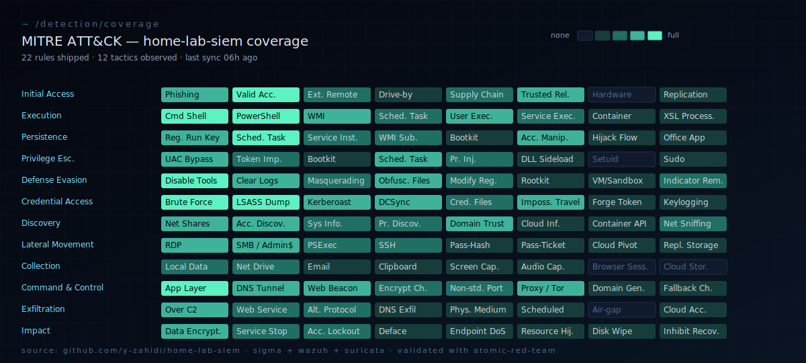
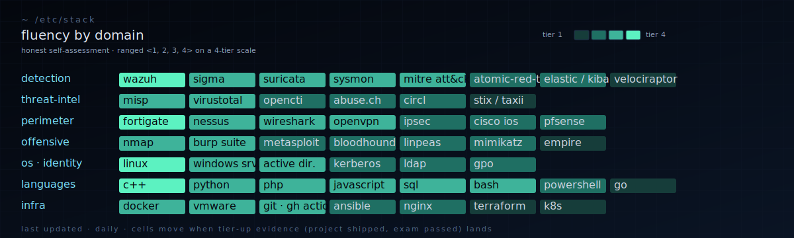

<!--
  ┌─────────────────────────────────────────────────────────────────────┐
  │  ~/operator-console — yassir.zahidi                                 │
  │  every section is a real file you'd find on my SOC box.             │
  │  built by hand — every SVG, every rule, every diagram.              │
  └─────────────────────────────────────────────────────────────────────┘
-->

<a href="https://y-zahidi.github.io">
  
</a>

<p align="center">
  <a href="https://y-zahidi.github.io"></a>
  <a href="https://github.com/y-zahidi/home-lab-siem"></a>
  <a href="https://www.linkedin.com/in/yassir-zahidi/"></a>
  <a href="mailto:yassirzahidi8@gmail.com"></a>
  
  
</p>

```text
$ whoami && cat /etc/role && cat /etc/looking-for
yassir.zahidi
specialized-technician-cybersecurity → computer-engineering-student
SOC / blue-team / DevSecOps internship — 2026 — Morocco · EU · remote
```

I deploy and run the kind of stack a small SOC actually uses: **Wazuh + Suricata + Sysmon + MISP + VirusTotal**, fronted by a **FortiGate** firewall and validated weekly with **Nessus**. I built that for real in May 2024 at the **Préfecture de Tétouan (SSIC, Ministère de l'Intérieur)**. The reproducible lab version lives on this profile — `docker compose up` and the SOC is online.

This page is a living operator console. Every section below is something I'd actually have open on a screen during a shift.

---

### `tail -f /soc/console`



> Numbers are illustrative · architecture mirrors the Préfecture de Tétouan deployment · log lines are the same shapes the production rules emit.

---

### `cat /now`

```yaml
location:    Rabat, Morocco
working_on:  home-lab-siem (atomic-red-team validation · MISP correlation)
shipping:    custom Wazuh decoders for FortiGate + Sysmon channel
learning:    OSCP path · Active Directory pivoting · DFIR (Velociraptor)
reading:     "The Practice of Network Security Monitoring" — Bejtlich
listening:   ColorADD · Maâlem Hamid el Kasri · Caravan Palace
available:   May 2026 onwards · open to remote / EU / Morocco
contact:     yassirzahidi8@gmail.com
```

---

### `cat /pipeline/home-lab-siem.mmd`

How a single suspicious sign-in travels from the host to a triaged ticket — the actual flow that runs in [home-lab-siem](https://github.com/y-zahidi/home-lab-siem).

```mermaid
flowchart LR
  classDef src   fill:#0a1424,stroke:#1f2f4a,color:#79e2ff;
  classDef proc  fill:#08111d,stroke:#5cf2c1,color:#5cf2c1;
  classDef ti    fill:#08111d,stroke:#febc2e,color:#febc2e;
  classDef sink  fill:#08111d,stroke:#79e2ff,color:#cfd6e4;
  classDef alert fill:#1a0a0c,stroke:#ff5f57,color:#ff8a8a;

  W[Windows / Sysmon]:::src --> AGT[Wazuh agent]:::src
  L[Linux / auditd]:::src   --> AGT
  FG[FortiGate firewall]:::src --> SYSLOG[syslog-ng]:::src
  NIDS[Suricata · eth1]:::src --> EVE[eve.json]:::src

  AGT --> MGR[Wazuh manager · custom decoders]:::proc
  SYSLOG --> MGR
  EVE --> MGR

  MGR --> CORR{rule + MITRE map}:::proc
  MISP[MISP · CIRCL · abuse.ch]:::ti --> CORR
  VT[VirusTotal lookups]:::ti --> CORR

  CORR -->|low|  IDX[(elastic index · 30d hot)]:::sink
  CORR -->|med| TRI[triage queue]:::sink
  CORR -->|high|PAGE[on-call page]:::alert

  IDX --> DASH[Kibana / portfolio dashboard]:::sink
  TRI --> DASH
  PAGE --> DASH
```

---

### `cat /detection/sample.{xml,yml,rules}`

Three syntaxes, one threat. Same impossible-travel sign-in pattern, written for **Wazuh**, **Sigma**, and **Suricata** — because real detection engineering means picking the right layer for each signal. All three map to MITRE [`T1078`](https://attack.mitre.org/techniques/T1078/) (*Valid Accounts*).

<details open>
<summary><b>wazuh</b> · <code>rules/100210-imp-travel.xml</code> · authentication layer</summary>

```xml
<rule id="100210" level="10">
  <if_group>authentication_failures</if_group>
  <same_source_ip />
  <same_user />
  <different_geoip />
  <description>Impossible-travel sign-in: same user, two countries &lt; 1h</description>
  <mitre>
    <id>T1078</id>
    <tactic>Initial Access</tactic>
  </mitre>
</rule>
```

</details>

<details>
<summary><b>sigma</b> · <code>rules/imp_travel_signin.yml</code> · cross-SIEM portable</summary>

```yaml
title: Impossible Travel Sign-in
id: 7e4a2c1e-9a0b-4b1d-8f3a-7c1f0a4d9b21
status: stable
description: Same user, two distinct GeoIP countries within 60 minutes.
author: Yassir Zahidi
references:
  - https://attack.mitre.org/techniques/T1078/
logsource:
  product: azure
  service: signinlogs
detection:
  selection:
    eventName: 'UserLoggedIn'
  timeframe: 60m
  condition: selection | count(distinct GeoIPCountry) by UserPrincipalName > 1
falsepositives:
  - VPN egress switch
  - Travelling executives (allowlist via UserPrincipalName)
level: high
tags:
  - attack.initial_access
  - attack.t1078
```

</details>

<details>
<summary><b>suricata</b> · <code>rules/local.rules</code> · network layer (Tor C2 fallback)</summary>

```text
alert tls $HOME_NET any -> $EXTERNAL_NET any ( \
  msg:"YZ TOR exit-node TLS handshake from internal host"; \
  flow:established,to_server; \
  tls.cert_subject; content:"CN="; nocase; \
  pcre:"/CN=([A-Za-z0-9]{16,})\.onion/i"; \
  threshold:type both, track by_src, count 1, seconds 600; \
  classtype:policy-violation; sid:9000111; rev:1; \
  metadata:mitre_attack T1090.003; )
```

</details>

[View the live coverage matrix on the portfolio →](https://y-zahidi.github.io/#detect)

---

### `cat /detection/coverage.svg`



The grid is honest: **bright = I have a rule shipping today**, **dim = on the roadmap**, **black = out of scope for the home lab** (e.g. air-gap exfil, hardware initial access). New cells light up as I push to [home-lab-siem](https://github.com/y-zahidi/home-lab-siem).

---

### `ls production-experience/`

<details open>
<summary><b>Préfecture de Tétouan — Ministère de l'Intérieur (SSIC)</b> · <i>Cybersecurity Intern · 02 May → 31 May 2024</i></summary>

> *Real ministry network. Real perimeter. Real consequences.*

- Designed and deployed a **multi-layer SIEM** on the production segment: Wazuh manager + Suricata IDS + Sysmon (Windows agents) + MISP threat-intel + VirusTotal lookups.
- Wrote **custom Wazuh decoders** for FortiGate syslog so we'd stop losing fields on rotation; mapped Suricata EVE alerts to MITRE ATT&CK in the alert pipeline.
- Wired MISP **CIRCL + abuse.ch** feeds on a 6-hour sync, plumbed VirusTotal hashing for any Sysmon `EventID=1` with a non-signed binary parent.
- Weekly **Nessus** scans against the perimeter, triage report to the SSIC chief.
- The full architecture, repackaged so anyone can `docker compose up`, lives at [`home-lab-siem`](https://github.com/y-zahidi/home-lab-siem).

</details>

<details>
<summary><b>ALTEN Maroc — Tétouan Shore</b> · <i>IT Support Technician (N1/N2) · Mar 2025 → Sep 2025</i></summary>

- **~70 Windows + VPN users** supported, 50+ tickets resolved end-to-end.
- Workstation hardening (BitLocker rollout, GPO baselines), incident response on three credential-phishing cases.
- Wrote runbooks the next intern still uses.

</details>

---

### `ls projects/`

| Project | Stack | What it actually does |
|---|---|---|
| **[home-lab-siem](https://github.com/y-zahidi/home-lab-siem)** | Wazuh · Suricata · Sysmon · MISP · Docker | The internship architecture, packaged. `docker compose up` and the SOC is live. |
| **[ctf-writeups](https://github.com/y-zahidi/ctf-writeups)** | Markdown | TryHackMe / HTB walkthroughs — methodology over flags, consistent template. |
| **[pentest-cheatsheet](https://github.com/y-zahidi/pentest-cheatsheet)** | Markdown | The cheatsheet I actually use — recon → AD → web → post-ex. |
| **[water-stress-morocco-analytics](https://github.com/y-zahidi/water-stress-morocco-analytics)** | MySQL · QlikView · Star schema | DWH on water stress in Morocco — 68k rows, 12 regions, 2015–2025. |
| **[FacturationPro-Enterprise](https://github.com/y-zahidi/FacturationPro-Enterprise)** | C++ · VCL · MySQL | Windows desktop billing — multi-user, role-based, PDF export. |

Also: [HTMLCamp](https://github.com/y-zahidi/HTMLCamp) · [Rabat-Cultural-Website](https://github.com/y-zahidi/Rabat-Cultural-Website)

---

### `cat /etc/stack`



---

### `ls certifications/`

| Issuer | Credential |
|---|---|
| Cisco | CCNA 1, 2 & 3 |
| Fortinet | FCF · NSE 1 · NSE 2 · NSE 3 |
| EC-Council | DFE *(Digital Forensics)* · EHE *(Ethical Hacking)* · NDE *(Network Defense)* |
| ICSI | Certified Network Security Specialist (CNSS) |
| Orange Digital Center | Cybersecurity — Rabat |
| French Embassy | DELF B2 — Diplôme d'Études en Langue Française (2025) |

---

### `cat /etc/principles`

```text
1. detection without telemetry is theater
2. write the runbook before you need it
3. every alert ships with its own triage steps and mitre id
4. an alert nobody reads is worse than no alert
5. document the falsepositive that almost fooled you, by name
6. blue team wins on boring tuesdays — not in incident war rooms
```

---

### `cat /etc/contact`

[`portfolio: y-zahidi.github.io`](https://y-zahidi.github.io) · [`linkedin: yassir-zahidi`](https://www.linkedin.com/in/yassir-zahidi/) · [`mail: yassirzahidi8@gmail.com`](mailto:yassirzahidi8@gmail.com) · [`resume.json`](https://y-zahidi.github.io/resume.json)

```text
$ exit 0
connection closed by foreign host.
```

<!--
  ───────────────────────────────────────────────────────────────────────
  if you read source you're already half a SOC analyst.
  flag{yz_read_my_decoders_-_let_us_talk}
  signal me. coffee on me in Rabat.
  ───────────────────────────────────────────────────────────────────────
-->
