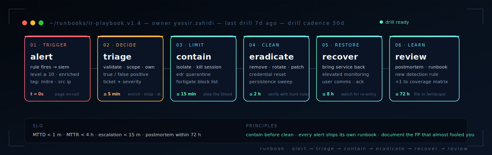
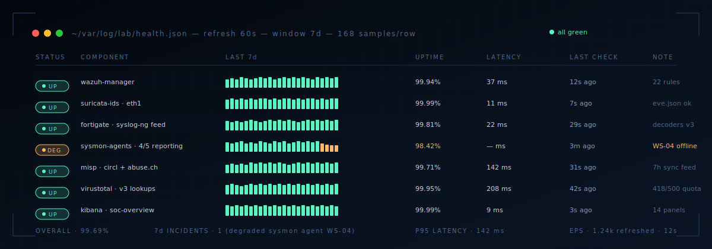

[](https://y-zahidi.github.io)

[](https://y-zahidi.github.io) [](https://github.com/y-zahidi/home-lab-siem) [](https://www.linkedin.com/in/yassir-zahidi/) [](mailto:yassirzahidi8@gmail.com) [](https://y-zahidi.github.io) [](https://y-zahidi.github.io)

# Yassir Zahidi

*cybersecurity engineering student · i build a soc-grade lab on my own time, then i attack it on purpose so it gets better.*

[](assets/cardstack.svg)

> blue is what i train for. red is the gym. purple is the loop where the two meet — every red find becomes a new blue rule the next day, and the rule gets re-fired against the same payload until it sticks. the rest of this page is the receipts.

---

### `// table of contents`

```
01  the-lab            home-lab-siem · architecture · proof
02  detections         triple-syntax sample · coverage matrix · playbook
03  activity           real contribution graph · shift simulation · uptime
04  history            préfecture de tétouan · alten · projects
05  toolchain          stack heatmap · certifications · principles
06  reach              four channels, async-first
```

---

## 01 · the lab — [`home-lab-siem`](https://github.com/y-zahidi/home-lab-siem)

A reproducible SOC-grade segment i run for myself. **Wazuh + Suricata + Sysmon + MISP + VirusTotal** behind a **FortiGate**, validated weekly with **Nessus** and beaten on regularly with **atomic-red-team**. The architecture mirrors what i helped deploy at the **Préfecture de Tétouan (SSIC, Ministère de l'Intérieur)** in May 2024 — repackaged so anyone can `docker compose up`.

I built the lab to learn defense end-to-end. Then i started attacking it on purpose to learn offense end-to-end. The two columns of this page are the same project, just from opposite sides of the firewall.

### `play /soc/killchain.mov`

A 30-second loop. An adversary walks every stage of the kill-chain — **recon → initial-access → foothold → priv-esc → lateral → exfil** — and every stage gets caught. Red glow when the technique is observed; blue glow when the matching detection rule fires. The terminal at the bottom is the same `tail -f /var/log/wazuh/alerts.json | jq -r .rule.description` shape that runs in the lab.

[](assets/killchain.svg)

> hand-coded SVG · SMIL only · no JS · same MITRE technique IDs the lab actually fires on (T1595, T1566.001, T1059.001, T1548.002, T1003.001, T1048.003) · MTTD median ≤ 1.7 s in this run, MTTR median ≤ 0.6 s, 6/6 stages contained.

### `pipeline.mmd`

How a single suspicious sign-in travels from the host to a triaged ticket — the actual flow that runs inside [`home-lab-siem`](https://github.com/y-zahidi/home-lab-siem).

```mermaid
flowchart LR
  classDef src   fill:#0a1424,stroke:#1f2f4a,color:#79e2ff;
  classDef proc  fill:#08111d,stroke:#5cf2c1,color:#5cf2c1;
  classDef ti    fill:#08111d,stroke:#febc2e,color:#febc2e;
  classDef sink  fill:#08111d,stroke:#79e2ff,color:#cfd6e4;
  classDef alert fill:#1a0a0c,stroke:#ff5f57,color:#ff8a8a;

  W[Windows / Sysmon]:::src --> AGT[Wazuh agent]:::src
  L[Linux / auditd]:::src   --> AGT
  FG[FortiGate firewall]:::src --> SYSLOG[syslog-ng]:::src
  NIDS[Suricata · eth1]:::src --> EVE[eve.json]:::src

  AGT --> MGR[Wazuh manager · custom decoders]:::proc
  SYSLOG --> MGR
  EVE --> MGR

  MGR --> CORR{rule + MITRE map}:::proc
  MISP[MISP · CIRCL · abuse.ch]:::ti --> CORR
  VT[VirusTotal lookups]:::ti --> CORR

  CORR -->|low|  IDX[(elastic index · 30d hot)]:::sink
  CORR -->|med| TRI[triage queue]:::sink
  CORR -->|high|PAGE[on-call page]:::alert

  IDX --> DASH[Kibana / portfolio dashboard]:::sink
  TRI --> DASH
  PAGE --> DASH
```

---

## 02 · detections

### `sample.{xml,yml,rules}` — three syntaxes, one threat

Same impossible-travel sign-in pattern, written for **Wazuh**, **Sigma**, and **Suricata**, because real detection means picking the right layer for each signal. All three map to MITRE [`T1078`](https://attack.mitre.org/techniques/T1078/) (*Valid Accounts*).

**wazuh · `rules/100210-imp-travel.xml` · authentication layer**
```xml
<rule id="100210" level="10">
  <if_group>authentication_failures</if_group>
  <same_source_ip />
  <same_user />
  <different_geoip />
  <description>Impossible-travel sign-in: same user, two countries &lt; 1h</description>
  <mitre>
    <id>T1078</id>
    <tactic>Initial Access</tactic>
  </mitre>
</rule>
```

**sigma · `rules/imp_travel_signin.yml` · cross-SIEM portable**
```yaml
title: Impossible Travel Sign-in
id: 7e4a2c1e-9a0b-4b1d-8f3a-7c1f0a4d9b21
status: stable
description: Same user, two distinct GeoIP countries within 60 minutes.
author: Yassir Zahidi
references:
  - https://attack.mitre.org/techniques/T1078/
logsource:
  product: azure
  service: signinlogs
detection:
  selection:
    eventName: 'UserLoggedIn'
  timeframe: 60m
  condition: selection | count(distinct GeoIPCountry) by UserPrincipalName > 1
falsepositives:
  - VPN egress switch
  - Travelling executives (allowlist via UserPrincipalName)
level: high
tags:
  - attack.initial_access
  - attack.t1078
```

**suricata · `rules/local.rules` · network layer (Tor C2 fallback)**
```
alert tls $HOME_NET any -> $EXTERNAL_NET any (
  msg:"YZ TOR exit-node TLS handshake from internal host";
  flow:established,to_server;
  tls.cert_subject; content:"CN="; nocase;
  pcre:"/CN=([A-Za-z0-9]{16,})\.onion/i";
  threshold:type both, track by_src, count 1, seconds 600;
  classtype:policy-violation; sid:9000111; rev:1;
  metadata:mitre_attack T1090.003; )
```

[See the live transpiler on the portfolio →](https://y-zahidi.github.io/#detect) — same sigma rule compiled live to Wazuh / Splunk SPL / KQL / Suricata as you type.

### coverage matrix

[](assets/coverage.svg)

### incident-response playbook

[](assets/playbook.svg)

---

## 03 · activity

### real contribution graph

<div align="center">

[](https://github.com/y-zahidi)

[](https://github.com/y-zahidi)

[](https://github.com/y-zahidi)

</div>

### what a shift looks like — `tail -f /soc/console`

The KPI tiles on the left are the metrics i'd check first thing on a real shift: alerts/24 h, EPS, MTTD, IOC feed health, lab uptime. The streaming log on the right is the shape the production rules emit; only the timestamps move.

[](assets/console.svg)

### lab uptime — `/uptime`

Seven days of synthetic uptime per component, last 50 alerts feed.

[](assets/uptime.svg)

---

## 04 · history

**Préfecture de Tétouan — Ministère de l'Intérieur (SSIC) · *Cybersecurity Intern · 02 May → 31 May 2024***

- Helped design and deploy a **multi-layer SIEM** on the production segment: Wazuh manager + Suricata IDS + Sysmon (Windows agents) + MISP threat-intel + VirusTotal lookups.
- Wrote **custom Wazuh decoders** for FortiGate syslog so we'd stop losing fields on rotation; mapped Suricata EVE alerts to MITRE ATT&CK in the alert pipeline.
- Wired MISP **CIRCL + abuse.ch** feeds on a 6-hour sync, plumbed VirusTotal hashing for any Sysmon `EventID=1` with a non-signed binary parent.
- Weekly **Nessus** scans against the perimeter, triage report to the SSIC chief.
- The architecture, repackaged so anyone can `docker compose up`, lives at [`home-lab-siem`](https://github.com/y-zahidi/home-lab-siem).

**ALTEN Maroc — Tétouan Shore · *IT Support Technician (N1/N2) · Mar 2025 → Sep 2025***

- **~70 Windows + VPN users** supported, 50+ tickets resolved end-to-end.
- Workstation hardening (BitLocker rollout, GPO baselines), incident response on three credential-phishing cases.
- Wrote runbooks the next intern still uses.

### projects

| project | stack | what it actually does |
|---|---|---|
| **[home-lab-siem](https://github.com/y-zahidi/home-lab-siem)** | Wazuh · Suricata · Sysmon · MISP · Docker | the internship architecture, packaged. `docker compose up` and the SOC is live. |
| **[ctf-writeups](https://github.com/y-zahidi/ctf-writeups)** | Markdown | TryHackMe / HTB walkthroughs — methodology over flags, one consistent template. |
| **[pentest-cheatsheet](https://github.com/y-zahidi/pentest-cheatsheet)** | Markdown | the cheatsheet i actually use — recon → AD → web → post-ex. |
| **[water-stress-morocco-analytics](https://github.com/y-zahidi/water-stress-morocco-analytics)** | MySQL · QlikView · star schema | DWH on water stress in Morocco — 68k rows, 12 regions, 2015–2025. |
| **[FacturationPro-Enterprise](https://github.com/y-zahidi/FacturationPro-Enterprise)** | C++ · VCL · MySQL | Windows desktop billing — multi-user, role-based, PDF export. |

Also: [HTMLCamp](https://github.com/y-zahidi/HTMLCamp) · [Rabat-Cultural-Website](https://github.com/y-zahidi/Rabat-Cultural-Website)

---

## 05 · toolchain

[](assets/stack.svg)

### certifications

| issuer | credential |
|---|---|
| Cisco | CCNA 1, 2 & 3 |
| Fortinet | FCF · NSE 1 · NSE 2 · NSE 3 |
| EC-Council | DFE *(Digital Forensics)* · EHE *(Ethical Hacking)* · NDE *(Network Defense)* |
| ICSI | Certified Network Security Specialist (CNSS) |
| Orange Digital Center | Cybersecurity — Morocco |
| French Embassy | DELF B2 — Diplôme d'Études en Langue Française (2025) |

### principles

```
1. detection without telemetry is theater
2. the best detection is a friendly red team — attack your own rules first
3. every alert ships with triage steps, a mitre id, and the payload that proves it fires
4. write the runbook before you need it; rehearse it with atomic-red-team
5. an alert nobody reads is worse than no alert
6. document the false-positive that almost fooled you, by name
7. blue is what i train for, red is the gym, purple is the loop — no skipped leg-day
```

---

## 06 · reach

Four channels. First reply within 24 h, async-first, time zone Africa/Casablanca.

[](assets/contact.svg)

| **web** | [`y-zahidi.github.io`](https://y-zahidi.github.io) | portfolio · live SOC console mock · sigma playground |
|---|---|---|
| **mail** | yassirzahidi8@gmail.com | roles · pentest gigs · interesting CTFs |
| **net** | [`linkedin/in/yassir-zahidi`](https://www.linkedin.com/in/yassir-zahidi/) | résumé · recommendations · timeline |
| **code** | [`github.com/y-zahidi`](https://github.com/y-zahidi) | everything you can read on this page |
| **cv** | [`resume.json`](https://y-zahidi.github.io/resume.json) | JSON-Resume schema · machine-readable |

```
$ exit 0
connection closed.  thanks for reading the receipts.
```
