<a href="https://y-zahidi.github.io">
  
</a>

```
$ whoami
yassir.zahidi
$ cat /etc/role
specialized-technician-cybersecurity → computer-engineering-student
$ cat /etc/looking-for
SOC / blue-team / DevSecOps internship — 2026 — Morocco · EU · remote
```

I deploy and run the kind of stack a small SOC actually uses: **Wazuh + Suricata + Sysmon + MISP + VirusTotal**, fronted by a **FortiGate** firewall and validated weekly with **Nessus**. I built that for real in May 2024 at the **Préfecture de Tétouan (SSIC, Ministère de l'Intérieur)**. The reproducible lab version is on this profile — `docker compose up` and you get everything online.

This page is a living index. The portfolio at **[y-zahidi.github.io](https://y-zahidi.github.io)** has the case study, the architecture diagram, and an interactive [MITRE ATT&CK detection coverage matrix](https://y-zahidi.github.io/#detect) of the rules I've shipped.

---

### `cat /now`

```yaml
location:    Rabat, Morocco
working_on:  home-lab-siem (atomic red team validation, MISP integration)
shipping:    custom Wazuh decoders for FortiGate + Sysmon channel
learning:    OSCP path · Active Directory pivoting · DFIR (Velociraptor)
reading:     "The Practice of Network Security Monitoring" — Bejtlich
available:   May 2026 onwards · open to remote / EU / Morocco
contact:     yassirzahidi8@gmail.com
```

---

### `cat /detection/sample.xml`

A real Wazuh rule from [home-lab-siem](https://github.com/y-zahidi/home-lab-siem) — fires on impossible-travel sign-ins (same user, two different countries, < 1h apart). Maps to MITRE [`T1078`](https://attack.mitre.org/techniques/T1078/).

```xml
<rule id="100210" level="10">
  <if_group>authentication_failures</if_group>
  <same_source_ip />
  <same_user />
  <different_geoip />
  <description>Impossible-travel sign-in: same user, two countries < 1h</description>
  <mitre>
    <id>T1078</id>
    <tactic>Initial Access</tactic>
  </mitre>
</rule>
```

[See the full ruleset and live coverage matrix →](https://y-zahidi.github.io/#detect)

---

### `ls production-experience/`

**Préfecture de Tétouan — Ministère de l'Intérieur (SSIC)** · *Cybersecurity Intern · 02 May → 31 May 2024*
Designed and deployed a multi-layer SIEM on a real ministry network — Wazuh + Suricata + Sysmon + MISP + VirusTotal, integrated with the FortiGate perimeter and Nessus weekly vuln scans. Wrote custom Wazuh decoders for FortiGate logs, mapped Suricata EVE alerts to MITRE ATT&CK, wired MISP feeds (CIRCL, Abuse.ch) on a 6-hour sync. The reproducible lab version is at [home-lab-siem](https://github.com/y-zahidi/home-lab-siem).

**ALTEN Maroc — Tétouan Shore** · *IT Support Technician (N1/N2) · Mar 2025 → Sep 2025*
Workstation hardening and incident response for ~70 Windows / VPN users · 50+ tickets resolved.

---

### `ls projects/ | head -5`

| Project | Stack | What it actually does |
|---|---|---|
| **[home-lab-siem](https://github.com/y-zahidi/home-lab-siem)** | Wazuh · Suricata · Sysmon · MISP · Docker | The internship architecture, packaged. `docker compose up` and the SOC is live. |
| **[ctf-writeups](https://github.com/y-zahidi/ctf-writeups)** | Markdown | TryHackMe / HTB walkthroughs — methodology over flags, consistent template. |
| **[pentest-cheatsheet](https://github.com/y-zahidi/pentest-cheatsheet)** | Markdown | The cheatsheet I actually use — recon → AD → web → post-ex. |
| **[water-stress-morocco-analytics](https://github.com/y-zahidi/water-stress-morocco-analytics)** | MySQL · QlikView · Star schema | DWH on water stress in Morocco — 68k rows, 12 regions, 2015–2025. |
| **[FacturationPro-Enterprise](https://github.com/y-zahidi/FacturationPro-Enterprise)** | C++ · VCL · MySQL | Windows desktop billing — multi-user, role-based, PDF export. |

Also: [HTMLCamp](https://github.com/y-zahidi/HTMLCamp) · [Rabat-Cultural-Website](https://github.com/y-zahidi/Rabat-Cultural-Website)

---

### `cat /etc/stack`

```
detection      wazuh · suricata · sysmon · sigma · atomic-red-team · mitre-att&ck
threat-intel   misp · virustotal · opencti
perimeter      fortigate · nessus · wireshark · openvpn · ipsec
offensive      nmap · burp · metasploit · bloodhound · mimikatz · linpeas
os             linux (debian/ubuntu) · windows server · active directory
dev            c++ · python · php · javascript · sql · bash
infra          docker · vmware · git · github actions
```

---

### `ls certifications/`

- **Cisco** — CCNA 1, 2 & 3
- **Fortinet** — FCF · NSE 1 · NSE 2 · NSE 3
- **EC-Council** — DFE (Digital Forensics) · EHE (Ethical Hacking) · NDE (Network Defense)
- **ICSI** — Certified Network Security Specialist (CNSS)
- **Orange Digital Center** — Cybersecurity (Rabat)
- **DELF B2** — Diplôme d'Études en Langue Française (2025)

---

### `cat /etc/contact`

[`portfolio: y-zahidi.github.io`](https://y-zahidi.github.io) · [`linkedin: yassir-zahidi`](https://www.linkedin.com/in/yassir-zahidi/) · [`mail: yassirzahidi8@gmail.com`](mailto:yassirzahidi8@gmail.com) · [`resume.json`](https://y-zahidi.github.io/resume.json)

```
$ exit 0
```
