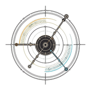
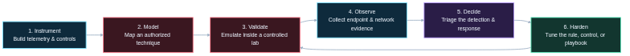
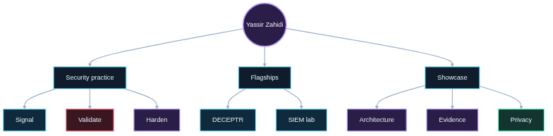

# Yassir Zahidi

**Security engineering student building systems that turn observed behavior into evidence, decisions, and stronger controls.**

> **FIELD MANUAL / 01**
> Observe → Model → Validate → Harden

I build and study detection systems, forensic context, controlled validation, cyberdeception, data workflows, and practical software. My public repositories are **case files**: architecture, reasoning, sanitized evidence, and engineering decisions from private personal implementations.

[Portfolio](https://y-zahidi.github.io) · [LinkedIn](https://www.linkedin.com/in/yassir-zahidi/) · [Résumé](https://y-zahidi.github.io/resume.json) · [Email](mailto:yassirzahidi8@gmail.com)

---

## The operating thesis

A control is unfinished until it produces useful evidence, supports a decision, and survives revalidation. I connect telemetry, controlled scenarios, forensic context, detection logic, triage, and hardening into a repeatable engineering loop.

| Stage | Question I ask |
|:--|:--|
| **Observe** | What signal, behavior, or failure is actually visible? |
| **Model** | What system boundary, threat path, or data relationship explains it? |
| **Validate** | Can the control be tested in an authorized, repeatable scenario? |
| **Harden** | What changed, and how will the result be rechecked? |

---

## Case-file index

### 01 / DECEPTR-UNIFIED

**Cyberdeception · DFIR · CTI correlation · controlled validation**

A unified platform design connecting decoy interaction, forensic collection, threat-intelligence context, and controlled validation. The public case file presents architecture, trust boundaries, sanitized configuration patterns, and engineering decisions behind a private implementation.

[Open the DECEPTR case file →](https://github.com/y-zahidi/DECEPTR-UNIFIED)

### 02 / home-lab-siem

**Wazuh · Suricata · Sysmon · MISP · MITRE ATT&CK**

A telemetry and detection laboratory where controlled scenarios become evidence, evidence becomes context, and context informs triage and hardening.

[Open the SIEM case file →](https://github.com/y-zahidi/home-lab-siem)

### 03 / Authorized security learning

**CTF methodology · attack-path analysis · defensive takeaways**

Owned labs, CTFs, and explicitly permitted environments are used to understand observability gaps, detection opportunities, and control trade-offs.

[CTF write-ups →](https://github.com/y-zahidi/ctf-writeups) · [Pentest notes →](https://github.com/y-zahidi/pentest-cheatsheet)

---

## Evidence ledger

| Public case-file evidence | Kept private by design |
|:--|:--|
| Architecture and trust boundaries | Complete implementation source |
| Sanitized configuration examples | Credentials, API keys, and infrastructure details |
| Mapped validation scenarios | Privileged deployment automation |
| Detection logic and engineering outcomes | Sensitive tuning and private datasets |
| Redacted screenshots and design notes | Third-party or employer-confidential material |

A showcase is not a source-code dump. Each public artifact is designed to be useful, honest, and technically reviewable without exposing operational material.

---

## Portfolio atlas

| Practice | What the repository collection demonstrates |
|:--|:--|
| **Security systems** | Detection, telemetry, DFIR context, deception surfaces, and validation loops. |
| **Product engineering** | Full-stack architecture, identity, dashboards, desktop workflows, and PDF generation. |
| **Data and operations** | Warehousing, ETL, regional analytics, Linux operations, and reporting interfaces. |

[Browse every public repository →](https://github.com/y-zahidi?tab=repositories)

---

## Engineering principles

1. **Evidence before assertion.**
2. **An authorized scenario is a test case for the control.**
3. **Every alert needs context, a triage action, and a false-positive story.**
4. **A control is not complete until it has been revalidated.**
5. **Private implementation does not mean vague explanation.**

---

## Connect

I am based in Morocco and building toward security engineering opportunities focused on detection, forensics, controlled validation, hardening, and practical systems engineering.

[Portfolio](https://y-zahidi.github.io) · [LinkedIn](https://www.linkedin.com/in/yassir-zahidi/) · [Email](mailto:yassirzahidi8@gmail.com) · [GitHub](https://github.com/y-zahidi)
