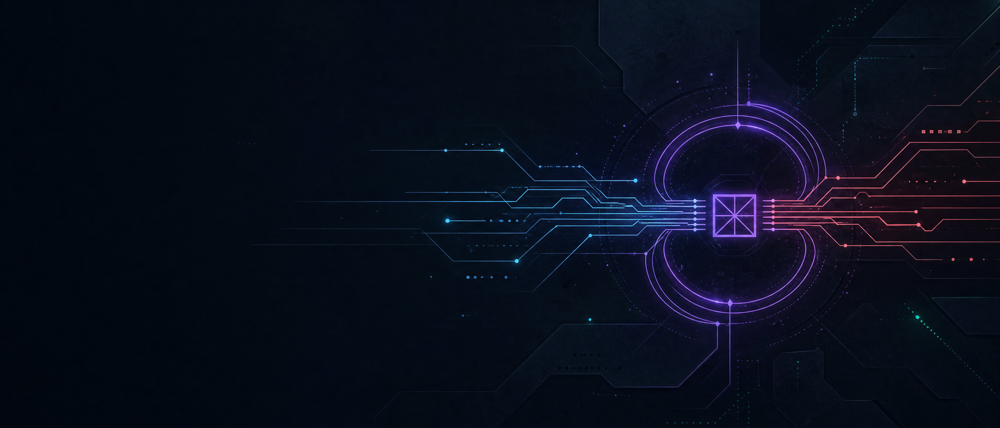
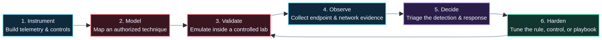
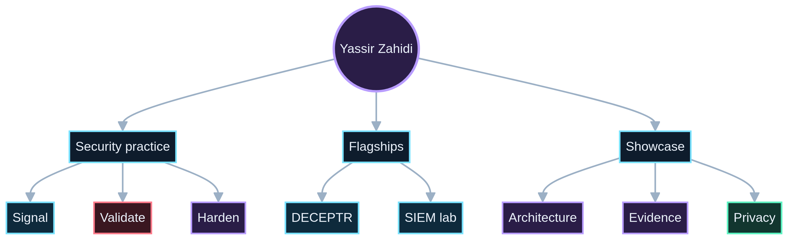

# Yassir Zahidi

**Adversary-informed security builder · Morocco · Detection engineering, cyberdeception, DFIR, and authorized security testing.**

I design defensive systems, validate them through controlled attack paths, and turn every finding into a stronger detection, control, triage decision, or hardening action.

[Portfolio](https://y-zahidi.github.io) · [LinkedIn](https://www.linkedin.com/in/yassir-zahidi/) · [GitHub](https://github.com/y-zahidi) · [Contact](mailto:yassirzahidi8@gmail.com) · [Résumé](https://y-zahidi.github.io/resume.json)

> **Signal. Validate. Harden. Repeat.**

---

## The validation loop

| **Signal** | **Validate** | **Harden** |
|:--|:--|:--|
| Build telemetry, detections, and defensive visibility. | Emulate realistic techniques in authorized labs and controlled environments. | Tune rules, controls, and response paths—then test the improvement again. |

My work sits at the point where offensive understanding improves defensive engineering. I focus on **what an attack should look like in telemetry, how a control should respond, and how to prove that the result is better.**

### Portfolio map

This visual index makes the structure of the portfolio easy to scan: security practice, flagship proof, and privacy-safe public evidence.

---

## Selected case studies

### [DECEPTR-UNIFIED](https://github.com/y-zahidi/DECEPTR-UNIFIED)

**Cyberdeception · DFIR · CTI correlation · attack simulation**

A unified security platform design that connects decoy interaction, forensic collection, threat-intelligence context, and controlled validation. The public repository presents the architecture, sanitized configuration patterns, and engineering decisions behind a private personal implementation.

[Explore the project →](https://github.com/y-zahidi/DECEPTR-UNIFIED)

### [home-lab-siem](https://github.com/y-zahidi/home-lab-siem)

**Wazuh · Suricata · Sysmon · MISP · MITRE ATT&CK**

A SOC-grade lab for detection engineering: telemetry is collected, attack paths are validated in a controlled environment, and resulting observations inform rules, triage, and hardening decisions.

[Explore the project →](https://github.com/y-zahidi/home-lab-siem)

### [Authorized offensive learning](https://github.com/y-zahidi/ctf-writeups)

**CTF methodology · attack-path analysis · defensive takeaways**

My offensive-security material is limited to CTFs, owned labs, and explicitly authorized environments. Every exercise is treated as a chance to understand observability gaps, detection opportunities, and defensive trade-offs.

[CTF write-ups →](https://github.com/y-zahidi/ctf-writeups) · [Pentest notes →](https://github.com/y-zahidi/pentest-cheatsheet)

---

## What is public—and what remains private

> **Portfolio showcase:** These repositories document architecture, selected sanitized configurations, validation evidence, and design decisions for private personal implementations. They intentionally exclude complete source code, operational secrets, and environment-specific deployment details.

| Public evidence | Kept private |
|:--|:--|
| Architecture and trust boundaries | Complete implementation source |
| Sanitized configuration examples | Credentials, API keys, and infrastructure details |
| MITRE-mapped validation scenarios | Privileged deployment automation |
| Detection logic and defensive outcomes | Sensitive tuning and private datasets |
| Redacted screenshots and engineering notes | Any third-party or employer-confidential material |

---

## Practice areas

| Blue | Red | Purple |
|:--|:--|:--|
| Telemetry engineering · detection logic · SIEM operations · incident triage | Authorized adversary emulation · CTF methodology · attack-path analysis | Detection validation · control tuning · deception · defensive feedback loops |

---

## Selected engineering breadth

| Project | Focus |
|:--|:--|
| [water-stress-morocco-analytics](https://github.com/y-zahidi/water-stress-morocco-analytics) | Data warehouse design, ETL, and regional analytics. |
| [eduflow-lms](https://github.com/y-zahidi/eduflow-lms) | ASP.NET Core architecture, identity, dashboards, and testing showcase. |
| [FacturationPro-Enterprise](https://github.com/y-zahidi/FacturationPro-Enterprise) | Desktop business software, SQLite, multi-user workflows, and PDF generation. |

---

## Principles

1. **Detection without telemetry is theatre.**
2. **An authorized attack path is a test case for the defense.**
3. **Every alert needs context, a triage action, and a false-positive story.**
4. **A control is not complete until it has been revalidated.**

---

## Connect

I am a Cybersecurity and Computer Engineering student based in Morocco, building toward detection engineering, SOC, and authorized security-testing opportunities.

[Portfolio](https://y-zahidi.github.io) · [LinkedIn](https://www.linkedin.com/in/yassir-zahidi/) · [Email](mailto:yassirzahidi8@gmail.com) · [GitHub](https://github.com/y-zahidi)
